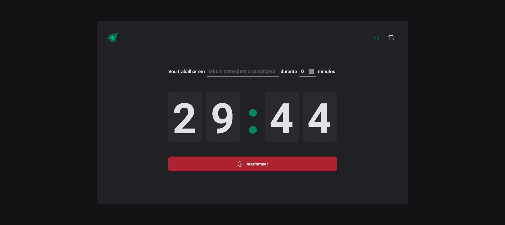
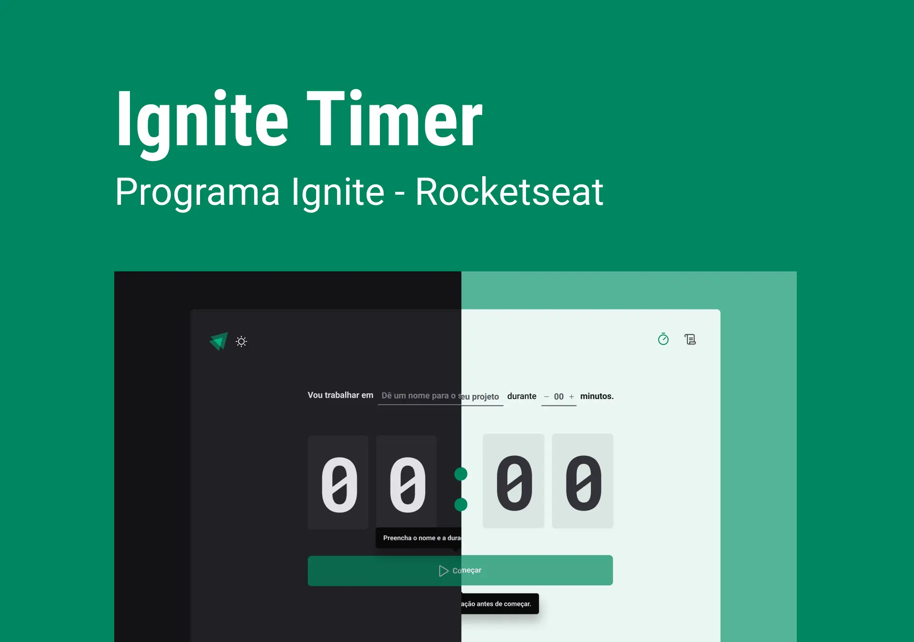

<!-- ===== HEADER (Badges) ===== -->
<p align="right">
  
  <a href="./README.pt-br.md" title="Ler o README em português brasileiro">
    
  </a>
</p>

<p align="center">
  <a
    href="https://guipmdev-ignite-timer.vercel.app/"
    title="Go to the web application"
  >
    
  </a>
</p>

<h1 align="center">Ignite Timer</h1>

<p align="center">
  
  
  
  <a
    href="https://github.com/guipmdev/ignite-timer/commits/main"
    title="View repository commits"
  >
    
  </a>
  <a href="./LICENSE" title="View project license">
    
  </a>
  <a href="https://www.rocketseat.com.br/" title="Go to the Rocketseat website">
    
  </a>
</p>



<p align="center">
  <a href="https://guipmdev-ignite-timer.vercel.app/"
    >Go to the web application ↗</a
  >
</p>

<details>
  <summary>
    <h2>📒 Table of Contents</h2>
  </summary>

- [📍 Overview](#-overview)
- [✨ Features](#-features)
- [🤖 Demo](#-demo)
- [🎨 Layout](#-layout)
- [🛠 Technologies](#-technologies)
  - [Website](#website)
  - [Utils](#utils)
- [🚀 Getting Started](#-getting-started)
  - [✔️ Prerequisites](#️-prerequisites)
  - [📦 Installation](#-installation)
  - [⚙️ Usage](#️-usage)
- [📄 License](#-license)
- [👏 Acknowledgments](#-acknowledgments)
</details>

<!-- ===== PROJECT INFOS ===== -->

## 📍 Overview

This project is a web application developed in _React_ and _TypeScript_ that serves as a timer tool for managing cycles. It allows users to create cycles with specific tasks and durations, interrupt cycles, and mark them as finished.

The application offers features such as countdown timers, history and an easy-to-use interface, improving productivity and time management skills.

## ✨ Features

⏱ Define **what you want to work on**, and **how long for**

🎯 **Change browser tab** and keep watching the time go by

🔄 Refresh the page **doesn't lose progress**

📃 View ongoing, completed and/or interrupted tasks in a **history** format

## 🤖 Demo

https://github.com/guipmdev/ignite-timer/assets/136738335/cad338b5-518c-4ffc-84d5-c7e78d0df639

## 🎨 Layout

The layout of the application was designed by **Rocketseat** and is available on [Figma](<https://www.figma.com/file/djb7QGcTHA3Qtunn77t7pB/Ignite-Timer-(Community)>).

<p align="center">
  
</p>

## 🛠 Technologies

The following tools were used to build the project:

### Website

<p>
  <a href="https://vitejs.dev/">
    
  </a>
  <a href="https://react.dev/">
    
  </a>
  <a href="https://www.typescriptlang.org/">
    
  </a>
  <a href="https://eslint.org/">
    
  </a>
  <a href="https://github.com/rocketseat/eslint-config-rocketseat">
    
  </a>
</p>

<p>
  <a href="https://reactrouter.com/">
    
  </a>
  <a href="https://react-hook-form.com/">
    
  </a>
  <a href="https://github.com/colinhacks/zod">
    
  </a>
  <a href="https://date-fns.org/">
    
  </a>
  <a href="https://immerjs.github.io/immer/">
    
  </a>
</p>

<p>
  <a href="https://styled-components.com/">
    
  </a>
  <a href="https://phosphoricons.com/">
    
  </a>
</p>

_\* See the [<kbd>package.json</kbd>](./package.json) file_

### Utils

<p>
  <a href="https://git-scm.com/">
    
  </a>
  <a href="https://nodejs.org/">
    
  </a>
  <a href="https://figma.com/">
    
  </a>
  <a href="https://fonts.google.com/">
    
  </a>
  <a href="https://code.visualstudio.com/">
    
  </a>
</p>

## 🚀 Getting Started

### ✔️ Prerequisites

Before you begin, ensure that you have the following tools installed on your machine: [Git](https://git-scm.com/downloads), [Node.js](https://nodejs.org/en/download). It's also good to have an editor to work with the code, such as [VSCode](https://code.visualstudio.com/Download).

### 📦 Installation

1. Clone the repository:

```sh
git clone https://github.com/guipmdev/ignite-timer/
```

2. Change to the project directory:

```sh
cd ignite-timer
```

3. Install the dependencies:

```sh
npm install
```

### ⚙️ Usage

1. Start the web application:

```sh
npm run dev
```

2. Access https://localhost:5173/ to view the application

## 📄 License

This project is licensed under the terms of the `MIT` license. See the
[LICENSE](./LICENSE) file for additional info.

## 👏 Acknowledgments

> - Many thanks to [Rocketseat](https://www.rocketseat.com.br/) for the layout and tips when putting this project together

<!-- ===== FOOTER ===== -->

---

<p align="center">
  Made with 💙 by
  <a href="https://www.guipm.dev/"> @guipm.dev </a>
  - Feel free to
  <a href="mailto:guipm.dev@gmail.com">contact me</a>!
</p>

<br />

<p align="center">
  <a href="#top">
    <b>↑&nbsp;&nbsp; Return to the top &nbsp;&nbsp;↑</b>
  </a>
</p>
